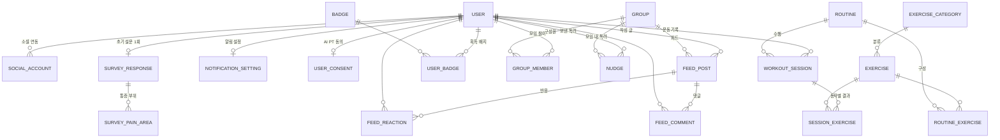

# ERD (제안)

> 작성일: 2026-08-18
> **프론트엔드가 API 계약서에서 역으로 도출한 제안입니다.** 실제 스키마는 백엔드가 정합니다.
> 근거: [`api-contract.md`](api-contract.md) · [`src/types/api.ts`](../spark-frontend/src/types/api.ts)

이 문서의 목적은 "화면이 이런 데이터를 요구하니 최소한 이 정보는 어딘가에 있어야 한다"를
보여주는 것입니다. 정규화 수준·인덱스·파티셔닝은 백엔드 판단입니다.

---

## 전체 구조



---

## 1. 사용자 · 인증

### USER
| 컬럼 | 타입 | 비고 |
|------|------|------|
| id | PK | |
| email | string, unique, nullable | 소셜 전용 계정은 없을 수 있음 |
| password_hash | string, nullable | 소셜 전용 계정은 없음 |
| nickname | string | 표시 이름. `GET /me` |
| status_message | string | "오늘도 건강하게 운동 중 🔥" |
| avatar_url | string, nullable | |
| created_at | timestamp | |
| deleted_at | timestamp, nullable | `DELETE /me` — 소프트 삭제 여부는 백엔드 판단 |

### SOCIAL_ACCOUNT
구글 로그인용. **가입과 로그인이 같은 요청**이라 이 테이블이 계정 생성 판단 기준이 됩니다.

| 컬럼 | 타입 | 비고 |
|------|------|------|
| id | PK | |
| user_id | FK → USER | |
| provider | enum | `google` |
| provider_user_id | string | **구글이 주는 sub 값** |
| created_at | timestamp | |

> **UNIQUE (provider, provider_user_id)**
> 식별자로 이메일을 쓰지 마세요 — 구글 계정 이메일은 바뀔 수 있습니다.

### SURVEY_RESPONSE
계정당 1회. `AuthSession.surveyCompleted`가 이 레코드 존재 여부입니다.

| 컬럼 | 비고 |
|------|------|
| user_id | PK 또는 FK+unique |
| fitness_level | "매우 낮음" … |
| activity_level | "거의 없음" … |
| available_time | "10분 이내" … |
| intensity | "가볍게" … |
| created_at | |

> ⚠️ 선택지 문자열은 **프론트가 추정**한 것입니다. enum으로 고정할지, 코드값+표시명을 나눌지 백엔드에서 정해주세요.

### SURVEY_PAIN_AREA
복수 선택이라 분리.

| 컬럼 | 비고 |
|------|------|
| survey_response_id | FK |
| area | `neckShoulder` `lowerBack` `kneeLeg` `wristElbow` `none` |

> `none`("통증 없음")은 다른 값과 함께 저장되지 않습니다.

---

## 2. 운동 · 루틴

### EXERCISE_CATEGORY
| 컬럼 | 비고 |
|------|------|
| id | `all`은 저장하지 않고 서버가 앞에 붙여주는 편이 낫습니다 |
| name | "스쿼트" "런지" "스트레칭" "기타" |
| sort_order | 칩 노출 순서 |

### EXERCISE
| 컬럼 | 비고 |
|------|------|
| id | PK |
| category_id | FK |
| name | "사이드 스쿼트" |
| thumbnail_url | nullable |
| reps_label | **"좌우 8~10회"** — 표기 문자열 그대로 저장 |
| sets | int |
| duration_minutes | int |
| ai_pt_supported | bool — **6종만 true** (아래 참고) |

> **AI PT 지원 운동 6종** (시안 `69:1695` 명시):
> 스쿼트 · 런지 · 턱 당기기 · 어깨 돌리기 · 가슴 열기 · 사이드 밴드
> 나머지 운동은 카메라 없이 진행합니다.

### ROUTINE
| 컬럼 | 비고 |
|------|------|
| id | PK |
| name | "목/어깨 스트레칭 + 코어강화" |
| owner_id | FK → USER, **nullable** — null이면 시스템 추천 루틴 |
| estimated_minutes | int |
| thumbnail_url | nullable |

### ROUTINE_EXERCISE
| 컬럼 | 비고 |
|------|------|
| routine_id | FK |
| exercise_id | FK |
| order | **진행 화면이 이 순서대로 소비합니다** |

---

## 3. 운동 세션 — 모든 통계의 원천

### WORKOUT_SESSION
**연속 출석·주간·월간 통계가 전부 이 테이블에서 나옵니다.**

| 컬럼 | 비고 |
|------|------|
| id | PK |
| user_id | FK |
| routine_id | FK, nullable — 운동 하나만 할 수도 있음 |
| started_at | timestamp |
| ended_at | timestamp, nullable |
| duration_seconds | int |
| status | `completed` / `aborted` |

> 프론트는 현재 **완료 시점에만** 호출합니다(`POST /sessions/{id}/complete`).
> 중단(`aborted`) 통계를 잡으려면 **세션 시작 API가 필요합니다** — 루틴 완료 화면의
> "중단 횟수 10번"이 이 값입니다.

### SESSION_EXERCISE
| 컬럼 | 비고 |
|------|------|
| session_id | FK |
| exercise_id | FK |
| order | |
| status | `completed` / `skipped` |

> 기록 화면의 "5개 완료, 1개 건너뜀"이 여기서 나옵니다.

---

## 4. 모임

### GROUP
| 컬럼 | 비고 |
|------|------|
| id | PK |
| name | nullable — 없으면 멤버 이름을 조합해 `title`로 내려줌 |
| description | "우리 진짜 거북목 되지 말자" |
| cover_url | nullable |
| invite_code | string(8), **unique** — `POST /groups/join` |
| created_by | FK → USER |
| created_at | |

### GROUP_MEMBER
| 컬럼 | 비고 |
|------|------|
| group_id | FK |
| user_id | FK |
| joined_at | |
| role | `owner` / `member` (권한 기획이 있으면) |

> **UNIQUE (group_id, user_id)**

### FEED_POST
| 컬럼 | 비고 |
|------|------|
| id | PK |
| group_id | FK |
| author_id | FK → USER |
| body | "오늘 스쿼트 20개 3세트 완료!" |
| image_url | nullable |
| created_at | |

### FEED_REACTION
| 컬럼 | 비고 |
|------|------|
| post_id | FK |
| user_id | FK |
| emoji | "🩷" "🔥" |

> **UNIQUE (post_id, user_id, emoji)** — 같은 이모지 중복 방지
> 화면은 이모지별 개수만 표시합니다.

### FEED_COMMENT
| 컬럼 | 비고 |
|------|------|
| id | PK |
| post_id | FK |
| user_id | FK |
| body | |
| created_at | |

---

## 5. 친구 · 독려

### 친구 = 모임 멤버 (별도 테이블 없음)

**`FRIENDSHIP` 테이블을 두지 않기로 했습니다.**

`GET /friends/activities`는 **내가 속한 모든 모임의 멤버 합집합**(나 제외)을 돌려줍니다.

```sql
SELECT DISTINCT u.* FROM users u
JOIN group_members gm  ON gm.user_id = u.id
JOIN group_members me  ON me.group_id = gm.group_id
WHERE me.user_id = :myId AND u.id <> :myId
```

**근거** — 시안에 친구 추가 화면이 없고, 대신 **8자리 초대코드**가 있습니다.
그게 사실상 사람을 추가하는 통로입니다. 별도 친구 기능을 만들면 초대코드와
친구요청이라는 두 개의 진입로가 생겨 사용자가 헷갈립니다.

이 앱의 사회적 단위는 **모임**입니다 — 홈의 "친구의 운동 현황"과 모임의
"구성원 운동 현황"이 같은 컴포넌트를 쓰는 것도 그 방증입니다.

> 모임에 속하지 않은 1:1 친구는 불가능해집니다. 그런 요구가 생기면
> 그때 `FRIENDSHIP`을 추가하면 됩니다.

### NUDGE
| 컬럼 | 비고 |
|------|------|
| id | PK |
| from_user_id | FK |
| to_user_id | FK |
| group_id | FK, nullable — 모임 화면에서 보냈으면 채움 |
| created_at | |

> UI 라벨은 화면마다 다릅니다(`재촉하기` / `잡도리`). **데이터는 하나입니다.**
> 스팸 방지를 위해 쿨다운(예: 같은 대상에게 하루 1회)이 필요할 수 있습니다.

---

## 6. 배지

### BADGE
| 컬럼 | 비고 |
|------|------|
| id | PK |
| name | "21일 연속" |
| icon_url | nullable |
| condition_type | `streak` / `session_count` / `nudge_count` … |
| condition_value | 21, 5, 10 … |

### USER_BADGE
| 컬럼 | 비고 |
|------|------|
| user_id | FK |
| badge_id | FK |
| progress | int — "14/21일"의 14 |
| earned_at | timestamp, **nullable** |

> 화면은 배지를 3그룹으로 나눕니다:
> `earned_at != null` → 획득 / `progress > 0` → 도전 중 / 나머지 → 잠김

---

## 7. 설정

### NOTIFICATION_SETTING
| 컬럼 | 비고 |
|------|------|
| user_id | PK |
| reminder_enabled | bool |
| reminder_time | "오전 8:00" 또는 time 타입 |
| friend_nudge_enabled | bool |
| group_activity_enabled | bool |

> `devicePermissionGranted`는 **기기 상태라 저장하지 않습니다.** 앱이 조회해서 표시만 합니다.

### USER_CONSENT
| 컬럼 | 비고 |
|------|------|
| user_id | PK |
| pose_analysis_agreed | bool |
| agreed_at | timestamp |
| revoked_at | timestamp, nullable |

> 시안 문구: *"동의를 철회하면 저장된 자세 데이터가 영구 삭제되며 복구할 수 없습니다."*
> 자세 데이터를 저장한다면 철회 시 삭제 처리가 필요합니다.
> **다만 현재 기획상 영상·자세 데이터는 저장하지 않습니다**(즉시 삭제) — 확인 필요.

---

## 8. 저장하지 않고 계산하는 값

아래는 **테이블이 아니라 `WORKOUT_SESSION` 집계**입니다.
프론트는 서버가 계산해서 내려주는 전제로 만들어졌습니다.

| 값 | 계산 방식 |
|----|-----------|
| `streakDays` | 오늘부터 역순으로 세션이 있는 연속 일수 |
| `weeklyAttendance` | 이번 주 월~일 각 날짜에 완료 세션 존재 여부 |
| `monthly.completedRoutines` | 이번 달 `status = completed` 세션 수 |
| `monthly.abortedCount` | 이번 달 `status = aborted` 세션 수 |
| `monthly.averageMinutes` | 이번 달 세션 `duration_seconds` 평균 |
| `monthBestStreak` | 이번 달 내 최장 연속 일수 |
| 모임 출석 `intensity` | 그날 운동한 멤버 수 ÷ 전체 멤버 수 (0~1) |

**성능 주의** — 홈 화면이 열릴 때마다 `streakDays`를 전체 세션에서 계산하면 부담이 됩니다.
일별 집계 테이블이나 캐시를 두는 편이 나을 수 있습니다. 백엔드 판단에 맡깁니다.

---

## 9. 기획 확인이 필요한 것

| # | 항목 |
|---|------|
| 1 | ~~친구 관계~~ → **모임 멤버로 확정.** `FRIENDSHIP` 불필요 |
| 2 | ~~세션 시작 API~~ → **추가함.** `POST /sessions` · `POST /sessions/{id}/abort` |
| 3 | ~~설문 선택지~~ → **코드값+표시명 분리로 확정** |
| 4 | **자세 데이터 저장 여부** — AI 파트 논의 중 (보류) |
| 5 | **모임 권한** — `owner`/`member` 제안. 삭제·강퇴는 owner만 |
| 6 | **넛지 쿨다운** — 같은 대상 하루 1회 제안 |
| 7 | **이미지 업로드** — presigned URL 방식 제안 |
